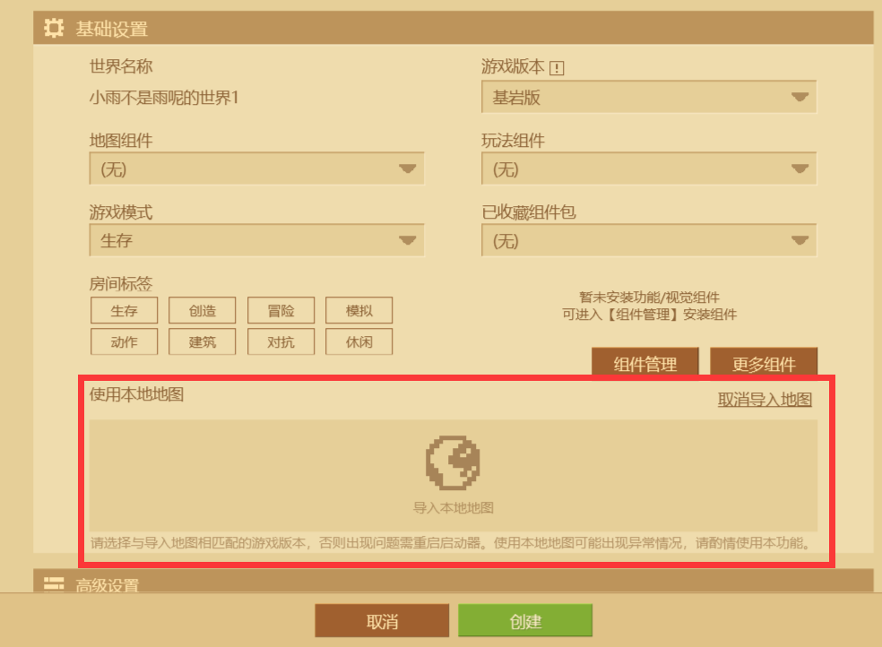

# 我的世界跑酷

## 介绍

一个中国版Minecraft的基岩跑酷地图 & 云崽（Yunzai-bot）闯关地图

跑酷&闯关暂时停止更新 （目前优化已有玩法） 优化完成继续更新

### 适合的设备

最佳设备: pc端

手机端与手柄玩家游玩会比较困难

图内跑酷闯关 手机端已测试可过

较难的关卡已放置跳关按钮

## 安装 & 使用教程

### 安装

```
git clone --depth 1 https://gitee.com/SHIKEAIXYY/Minecraft.git
```

#### 后续更新

```
cd Minecraft & git pull
```

### 使用 

1.创建房间 

2.使用本地地图


3.导入后创建然后启动即可游玩

4.如出生点不是紫水晶屋 可使用：

```
/clearspawnpoint @p
```
```
/kill
```
## 游玩注意事项

1.默认游戏模式调成`冒险`

2.难度调成`和平`

3.世界选项只开启`自然生命回复，立即重生`

4.作弊只开启`保留物品栏，启用命令方块`

5.作弊选项中昼夜更替可自行开启或关闭

## 参与贡献

以下名均为游戏名称

1.**小雨不是雨呢**  `QQ：536606294` 负责：主世界指令跑酷，主世界部分跑酷，主世界云崽闯关，大量红石与指令，地形建设，测试地图bug，创意玩法，优化跑酷与红石

2.**浪vs子**  `QQ：3364523590` 负责：主世界大部分跑酷，地形建设，创意玩法，大量红石，少量指令，测试地图bug

3.**枫园万叶ikun**  `QQ：3548898563` 负责：下届地狱跑酷，主世界末地跑酷，少量红石，测试地图bug

4.**KMnO4_awa**  `QQ：3268483837` 负责：钻石跑酷，黄金跑酷，Part4超难跑酷

## 免责声明

1. 功能仅限内部交流与小范围使用，请勿将 `本仓库内容` 用于任何以盈利为目的的场景；
2. 素材均为自制，仅供交流学习使用，如有侵权请联系，会立即删除。
